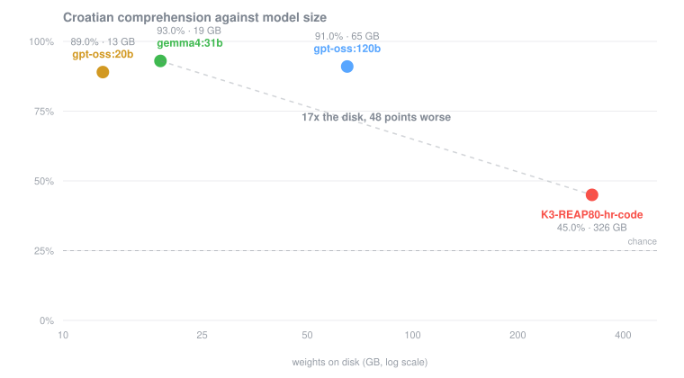
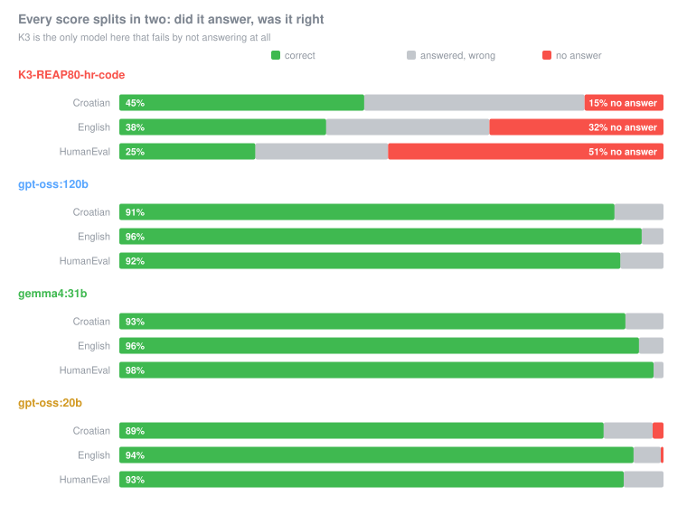
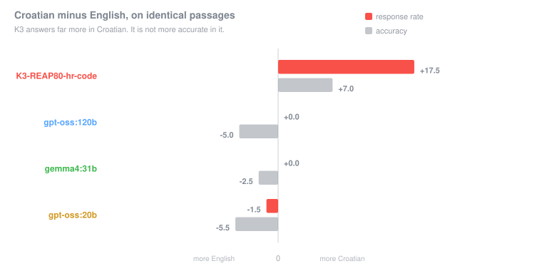
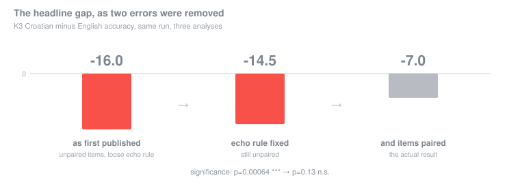

# kimi-k3-hr

**Deleting 80% of a 2.8-trillion-parameter model's experts to make it fit on one Mac — and choosing which 20% survive so that Croatian does.**

---

## The idea

Kimi K3 is a Mixture-of-Experts model. 2.8 trillion parameters, but each of its 92 MoE layers holds **896 separate expert networks**, and only **16 of them fire for any given token**. It is not one monolithic brain. It is a warehouse of specialists, and any single token wakes a handful of them.

Which raises an obvious question. Somewhere in those 896 experts per layer are specialists for Chinese poetry, Japanese morphology, Arabic script, competitive C++, and a thousand things I will never ask it for. I want Croatian and Python.

**What if I just deleted the rest?**

That isn't a thought experiment here — it's the only option left. K3 does not fit on a Mac Studio at *any* precision: the smallest full tier is ~870 GB against 512 GB of RAM, and squeezing it in would need ≤1.38 bits per weight. Quantisation has run out of room.

And the two levers are not variations on a theme:

|  | what it does | analogy |
|---|---|---|
| **Quantisation** | reduces the precision of every weight; everything survives, slightly degraded | JPEG compression |
| **Pruning** | deletes whole experts; some capabilities survive perfectly, others vanish | cropping |

[REAP](https://github.com/PipeNetwork/kimi-k3-mlx) does the second. Run a calibration corpus through the model, measure how much each expert actually contributes to the output, delete the low scorers. **The calibration corpus is therefore the specification of what the model is allowed to keep** — feed it Chinese and code, and you keep the experts that serve Chinese and code.

The published builds calibrate on ~40% code, ~30% English, ~15% Chinese and ~15% split across ja/ru/ko/de/fr/es/ar. Croatian appears nowhere in it.

So this repo does the obvious experiment: **calibrate on Croatian instead, keep 179 of the 896 experts, throw away 80% of the model, and find out whether what survives can still do the one thing you kept it for.** The result is a 326 GiB build running at 5.4 tok/s, measured against three models small enough to be uninteresting.

> **One thing to get straight first, because it is the most common misunderstanding: pruning buys fit, not speed.** *Total* parameters decide whether a model fits in memory; *active* parameters decide how fast it runs. Deleting experts shrinks the total while leaving top-16 routing untouched — so this 601B build has the same ~104B active as the 2.8T original, and decodes no faster than the full model would. It just fits.

Everything here was measured on one machine. Every table and figure below is generated from the raw per-item records by `eval/analysis.py` and `eval/charts.py`.

---

## The result in one chart



A 19 GB model reads Croatian 48 points better than the 326 GiB pruned one, and runs 5× faster doing it.

| model | on disk | Croatian | English | HumanEval | peak RSS | tok/s |
|---|---|---|---|---|---|---|
| **K3-REAP80-hr-code** | 326 GB | **45.0%** | 38.0% | 25.0% | **325 GB** | 5.4 |
| gpt-oss:120b | 65 GB | 91.0% | 96.0% | 92.1% | 74 GB | 76.6 |
| gemma4:31b | 19 GB | **93.0%** | 95.5% | **98.2%** | 56 GB | 28.0 |
| gpt-oss:20b | 13 GB | 89.0% | 94.5% | 92.7% | **25 GB** | **106.8** |

200 Belebele items per language, all 164 HumanEval problems, greedy decoding, identical prompts. Chance on Belebele is 25%.

**So the pruned model is not competitive as a system.** 6× the resident memory and 17× the disk of gemma4:31b, to run 5× slower and score worse on every task. If your goal is a usable local model, this is the wrong approach and the rest of this repo is about *why*, not about salvaging it.

---

## Finding 1 — the damage is to response initiation, not capability



K3 frequently produces **no answer at all**: the first token it predicts is a stop token. Split each score into "did it answer" and "was it right when it did", and the failure is bimodal:

| | responded | correct *when* it responded |
|---|---|---|
| **K3** Croatian | 85.5% | 52.6% |
| **K3** English | 68.0% | 55.9% |
| **K3** HumanEval | 49.4% | **50.6%** |
| all three comparators | 98–100% | 91–98% |

On HumanEval the split is exact: **83 of 164 prompts produced zero tokens and scored 0. The other 81 produced code and passed 50.6%.**

> Raw pass@1 of 25% reads as *"this model cannot code."* It codes at 51% and stays silent half the time. Those are different failures and only one of them is about coding.

Roughly half of K3's competence survives pruning intact. What collapses is the ability to *begin*. Full generations for every failure mode — including the silent ones, with the same prompts answered by gemma4:31b for contrast — are in [`results/examples/`](results/examples/examples.md).

## Finding 2 — the Croatian targeting moved compliance, not comprehension



On identical passages, K3 answers 17.5 points more often in Croatian — and is **not** more accurate in it:

| paired, n=200 | Croatian | English | p (McNemar) |
|---|---|---|---|
| **responded at all** | 85.5% | 68.0% | **5.1e-05** \*\*\* |
| **echoed the passage** | 8.0% | 22.5% | **8.2e-05** \*\*\* |
| accuracy | 45.0% | 38.0% | 0.13 n.s. |
| accuracy *given* a response | 52.6% | **55.9%** | — |

Conditional on answering, K3 is marginally *better* in English. All three comparators lean the other way on accuracy (+2.5 to +5.5 toward English, significant for gpt-oss:120b and gpt-oss:20b, not for gemma4:31b) and none shows a significant response-rate asymmetry. A per-item sign test on `d_K3 − d_comparator` puts K3's asymmetry at **p ≈ 5e-05** against all three.

Read together with Finding 1, these are one result:

> **Pruning damages response initiation rather than comprehension, and the calibration corpus determines which languages keep the ability to initiate.**

Our calibration corpus was 24.6% Croatian against 9.9% English. Croatian is where the model still answers.

---

## The part that is actually worth your time

Four of this project's bugs produced **plausible-looking numbers that were wrong**, and all four were found *after* the run finished, by building tooling to reproduce results that already existed. None required rerunning a model.



The first published version of this README claimed K3 was **16 points better at Croatian than English** — a clean, quotable, wrong result. Two independent errors made it:

**The language comparison was never paired.** Belebele's entire methodological value is that it is parallel — the same 900 passages in every language — so `score(eng) − score(hrv)` isolates language ability from item difficulty. We sampled each language independently with the same seed, and got **48 items in common out of 200**, because `shuffle(seed)` fixes the permutation, not the outcome: each language config stores its rows in a different order. The English items it happened to draw were harder for *every* model. That inflated K3's advantage and masked the comparators' real English advantage simultaneously.

**The echo detector had no minimum length.** It flagged a response as "restated the passage" if its first 40 characters appeared in the prompt's first 200. The expected answer is a single digit, and most passages contain that digit by chance — so a bare correct `2` was classified as an echo and scored wrong. 253 items affected. For all three comparators it was **100% of their reported echoes**; those models never echoed once.

Correcting the second one *raised the comparators by 8–11 points and K3 by only 3–6* — it made our own result look worse. That asymmetry is the only reason to trust the other corrections.

Two more in the same family: the published tok/s averaged per-item rates, counting 83 zero-token generations as "0 tokens/second" (K3 was 5.4, not 4.3); and the significance test printed `p = 0` for what was really 3e-42, because `1 − normal_cdf(z)` cancels to exactly zero past |z| = 8.

**[`LOG.md`](LOG.md) has all 29, symptom → cause → fix → lesson.** A sample:

- **#10** — a tokenizer registered K3's control tokens as generic placeholders, so `<|open|>` encoded as five *ordinary* text tokens. The model was shown its own chat markup as prose and did the sensible thing: it continued the text. Textbook over-pruned-model symptoms, entirely a tokenizer bug. *A tokenizer bug and a capability collapse are indistinguishable from the output alone.*
- **#18** — a checkpoint keyed on Belebele's `question_number`, which takes exactly two distinct values across 900 rows. A 200-item run reported `n=200` from **two** real model calls. The tell was accuracy exactly equalling parse rate.
- **#8** — `--profile mxfp4` quantises experts and leaves everything else at bf16: 114 GB of non-expert weights re-read every single token. 1.14 tok/s, looking exactly like a broken prune. One flag: **4.5×**.
- **#29** — the calibration corpus had no held-out tail. Calibration consumed 262,144 tokens of a 262,988-token corpus, leaving 844. Sizing the corpus to exactly what calibration would consume felt efficient and silently foreclosed every held-out measurement in the project.

---

## Is the build sound?

The conversion is verified. The toolchain's `verify.py` compares the artifact against the source: 59/59 shards, zero missing tensors, zero orphans, and 24 experts sampled across layers 8–86 dequantised and compared against the same experts in the source — **all bit-exact, `cos 1.00000`** — following the keep map. [`build/verify.log`](build/verify.log).

That rules out the failure this result would otherwise most likely be: a router renumbering fault, where surviving experts are reindexed but the router still points at the old rows. It yields a model that loads, emits fluent grammatical text, and routes every token to the wrong specialists — indistinguishable from our result by inspection. It is not what happened.

**What is still open**, stated plainly:

- **The generation path is not independently validated.** Finding 1 is entirely a claim about generation behaviour, which depends on the chat template, the control-token ids and the stop set — and two of this project's worst bugs lived in exactly that code. Finding 2 is robust to this (both languages use the identical template), Finding 1 is not.
- **No unpruned baseline exists anywhere.** ~870 GB against 512 GB of RAM. No unpruned K3 has produced a token on Apple silicon — not here, and not in the toolchain that published these builds. "How much did pruning cost" is not directly answerable by anyone today.
- **No control arm.** The decisive experiment is the published `Kimi-K3-REAP80-MLX-mxfp4-q8` — same 179/896 ratio, same quantisation profile, *different calibration corpus* — run through this harness. If it scores ~85%, the collapse is ours. If it scores ~40%, the collapse is REAP's at this ratio. **That is the gap between "a model" and "a claim."**

Full limitations in [`RESULTS.md`](RESULTS.md).

---

## Method

**One corpus, one calibration, every arm derived from it.** `corpus/recipes/survey.yaml` tags all eight sources separately (hr, code, en, sr, ru, de, zh, fr). Calibrate once, then `reap_subset.py` sums whichever buckets an arm needs — *"same tokens, same layer states, same conditions, so any difference between the resulting builds is attributable to the target distribution and nothing else."*

An earlier design used three separate corpora and three calibration runs. That was wrong: run-to-run variance would have been inseparable from the corpus effect.

```bash
uv run corpus/build_corpus.py corpus/recipes/survey.yaml --out build/survey
python $K3_MLX/scripts/reap_calibrate.py --src $K3_SRC --out build/survey.saliency.npz \
    --calib-text build/survey.txt --seqs 128 --seqlen 2048        # ~2h, 58 GB peak
python $K3_MLX/scripts/reap_subset.py --saliency build/survey.saliency.npz \
    --keep-sources hr,code --out build/hr-code.saliency.npz
python $K3_MLX/scripts/reap_plan.py --saliency build/hr-code.saliency.npz \
    --mode uniform --out build/hr-code.plan.json
python $K3_MLX/scripts/convert.py --src $K3_SRC --out $K3_BUILD \
    --profile mxfp4 --nonexpert-bits 8 --prune-plan build/hr-code.plan.json
```

Steps 2–5 use [PipeNetwork/kimi-k3-mlx](https://github.com/PipeNetwork/kimi-k3-mlx). This repo supplies the corpus design, the eval harness, and the measurements.

That toolchain is referenced rather than copied in here. It ships no licence, so redistributing it is not ours to do — and it is under active correction upstream, where a recent commit fixed a **27× error** in its own published throughput figures. A vendored snapshot would freeze whichever numbers were wrong on the day it was taken. **The builds and measurements in this repo used commit `15ecbd0`**; pin your checkout to it if you want to reproduce them exactly.

`build/` is committed — 17 MB containing the tagged calibration saliency, the prune plan, the corpus and the verification log. **`survey.saliency.npz` is the expensive artifact**: hours of compute, and with it any alternative arm (reference mix, `hr-only`, `hr-heavy`) can be derived without recalibrating.

### Expert overlap between languages

A by-product of the tagged calibration, and interesting on its own (chance baseline 27.0%):

```
        code     de     en     fr     hr     ru     sr     zh
 hr    29.2%  62.3%  57.0%  61.6%    —    73.9%  68.0%  47.9%
 code    —    34.1%  28.8%  34.3%  29.2%  28.2%  37.4%  23.8%
```

**hr↔ru at 73.9% is the strongest pair in the matrix.** Croatian's experts are substantially Russian's experts — and Russian *is* in the reference mix, so Croatian partially survives on a neighbour's coattails rather than dying outright. And **code↔zh at 23.8% is *below* chance**: code and Chinese actively avoid each other's experts.

---

## Reproducing

```bash
git clone https://github.com/DLOVRIC2/kimi-k3-hr
cd kimi-k3-hr

# the conversion toolchain lives in a separate upstream repo
git clone https://github.com/PipeNetwork/kimi-k3-mlx ../kimi-k3-mlx

export K3_MLX=$(cd ../kimi-k3-mlx && pwd)
export K3_SRC=/path/to/Kimi-K3-src      # source weights (~1.4 TB)
export K3_BUILD=/path/to/your-build     # the pruned model

uv sync
# upstream mlx-lm has no K3 model class; register it into THIS venv
"$K3_MLX/scripts/install_model.sh" .venv/bin/python

bash eval/sweep.sh                # ~5h, resumable, writes results/full/
bash eval/pair_up.sh              # ~55m, re-scores English on the Croatian item set
uv run eval/rescore.py            # seconds, no GPU: corrected echo rule
uv run eval/analysis.py           # regenerates every table above
uv run eval/charts.py             # regenerates every figure above
uv run eval/capture_examples.py   # full text for a stratified sample of items
```

The `install_model.sh` step is required and `uv sync` cannot do it — see [`LOG.md`](LOG.md) #17.

Every arm checkpoints per item, so an interrupted run costs at most one item. Three generations of the data are kept side by side rather than overwritten — `results/full/` (as run), `results/paired/` (matched item sets), `results/rescored/` (corrected echo rule) — because each correction is a result in its own right, and the only way to show what unmatched sampling costs is to keep the before.

| | |
|---|---|
| [`RESULTS.md`](RESULTS.md) | full findings, significance tests, limitations |
| [`LOG.md`](LOG.md) | 29 bugs, symptom → cause → fix → lesson, and 15 transferable lessons |
| [`results/examples/`](results/examples/examples.md) | full generations, K3 vs gemma4:31b on identical prompts |
| `build/` | the artifacts that define the model |

---

## Licence and provenance

Kimi K3 is released under an MIT-structured licence permitting derivative works; restrictions apply only to Model-as-a-Service operators above $20M monthly revenue or 100M MAU. Neither applies here. Moonshot consistently say "open weight", never "open source" — worth matching that language.

**REAP cannot leak a calibration corpus.** It deletes experts, it does not train — surviving weights are bit-identical to Moonshot's originals and no gradient ever touches them. The saliency file is aggregate scores and the plan is a list of integers; neither has the bandwidth to encode source text. Every corpus source here is public and ungated, for reproducibility rather than privacy.
